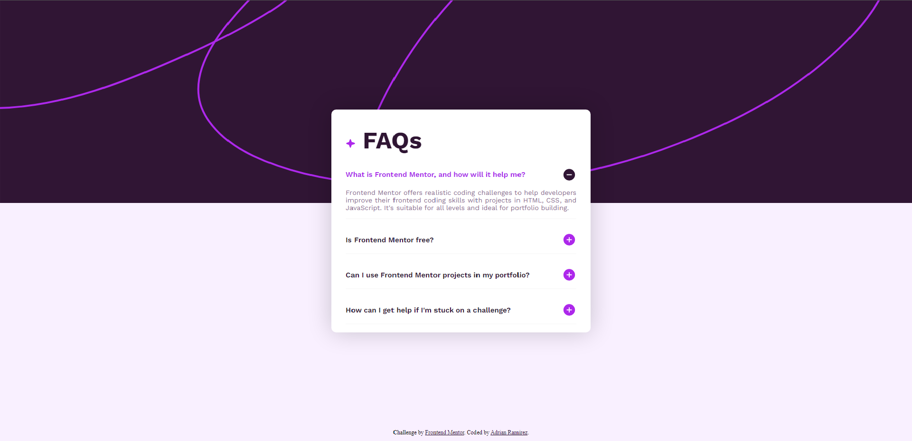
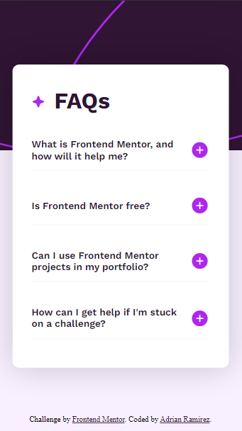

# Frontend Mentor - FAQ accordion solution

This is a solution to the [FAQ accordion challenge on Frontend Mentor](https://www.frontendmentor.io/challenges/faq-accordion-wyfFdeBwBz). Frontend Mentor challenges help you improve your coding skills by building realistic projects.

## Table of contents

- [Overview](#overview)
- [The challenge](#the-challenge)
- [Screenshot](#screenshot)
- [Links](#links)
- [Built with](#built-with)
- [Useful resources](#useful-resources)
- [Author](#author)

## Overview

### The challenge

Users should be able to:

- Hide/Show the answer to a question when the question is clicked
- Navigate the questions and hide/show answers using keyboard navigation alone
- View the optimal layout for the interface depending on their device's screen size
- See hover and focus states for all interactive elements on the page

### Screenshot

### Links

- [Solution URL](https://faq-accordion-adrianr1189.pages.dev/)
- [Frontend Mentor Challenge URL](https://www.frontendmentor.io/challenges/faq-accordion-wyfFdeBwBz)

### Built with

- Semantic HTML5 markup
- CSS custom properties
- Flexbox
- CSS media queries
- Javascript

### Useful resources

- [Color Picker](https://a.atmos.washington.edu/~ovens/javascript/colorpicker.html) - This helped me quickly match colors from the source images.

## Author

- My Github - https://github.com/AdrianR1189
- Frontend Mentor - [@AdrianR1189]https://www.frontendmentor.io/profile/AdrianR1189
